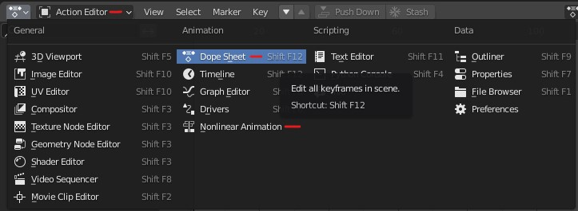
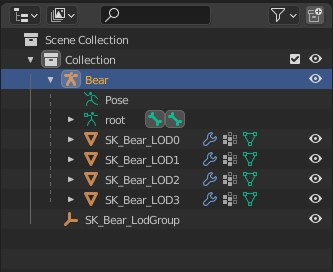
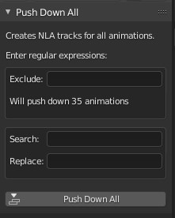
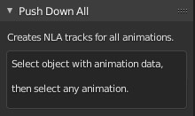
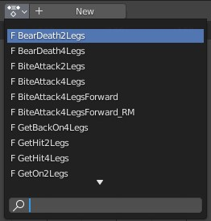
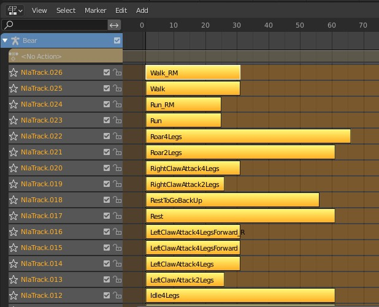

# PushDownAll
An addon for Blender 2.8+ that runs `Push Down` on all animations, creating NLA tracks for each.

This is useful if you have an object with many animations, and you need to convert them all to NLA tracks, say for GLTF export for a game engine. Godot Engine currently requires animations baked as NLA tracks.

## Installation

* Install PushDownAll.py into your script directory. e.g. "C:\Users\\`yourname`\AppData\Roaming\Blender Foundation\Blender\\`version`\scripts\addons\"

* In Blender, select Edit, Preferences, Add-ons. Find "Animation: Push Down All" and enable it.

## Usage 

* Open the `Dope Sheet` and switch to the `Action Editor`. You'll also want to open `Nonlinear Animation` in another window.

* Select your object in the outliner. Choose the node which is the parent of `Pose` or `Animation`.

* In the Dope Sheet window, press `N` for the sidebar and you should see the `Push Down All` panel.

* If there are no NLA channels (i.e. the NLA window is completely empty), you may need to select one of the animations, which will create an NLA channel. The addon should alert you as below. Select the animation from the middle button on the header bar.

### Parameters

* **Exclude:** You can enter a regular expression (Python `search()`) in the exclude box to skip animations. e.g. 'alk' or '[wW]alk' would match animations named 'walk_forward' and 'FastWalk'.

* **Search & Replace:** Search takes a regular expression and will replace any matching parts of names with whatever is found in the replace box (including nothing to erase the matching part). e.g. Search: 'alk', Replace: '', will turn the previous animations into 'w_forward' and 'FastW'. **This will change the name of the animation, not just the NLA track.**

* Finally, click `Push Down All` to get your NLA tracks.

* If you wish to do it again, move your mouse to the NLA window, and press `X` or `A, X` to delete all NLA tracks. 

## Troubleshooting

Turn on the console (Window -> Toggle System Console). This addon prints the name of every animation it pushes down. Error messages will appear here.

## Quick Regex Primer 

Really basic searches will work just fine. Regex is for power users. If you are having trouble matching symbols, try prefacing the symbol with a `\`, e.g. `\.` to match a period.

`^` = match the beginning 

`$` = match the end 

`[a-zA-Z]` = match one character, `a` through `z` or `A-Z`. Can also do numbers, `0-9`. Insert `^` as the first character to negate the match.

`[^0-9]4` = match 4 characters, none of which are 0-9

`.` = match any single character

`.4` = match any 4 characters

`.*` = match any number of characters including none 

`.+` = match at least 1 of any character

`\.` = match the period `.` Use \ before any symbols you want to match like `()[]$^\.*+` etc. e.g. `Walk\(1\)` for `Walk(1)`

`|` = match anything on the left, or anything on the right. Logical OR.

`( )` = container that limits the scope of the logical OR above.

**Examples**

`^Key` -> Matches `Key` only at the beginning of the name

`_RM$` -> Matches `_RM` only at the end of the name

`^Key\..*_RM$` -> Match names that start with `Key.`, end with `_RM`, and have anything or nothing in the middle

`^([^K]|Key\.)` -> Matches names that either don't begin with `K`, or start with `Key.`. `Apple` or `Key.Apple` would match, `Key` would not.

Full regex syntax: https://docs.python.org/3/library/re.html#regular-expression-syntax

## License

MIT
